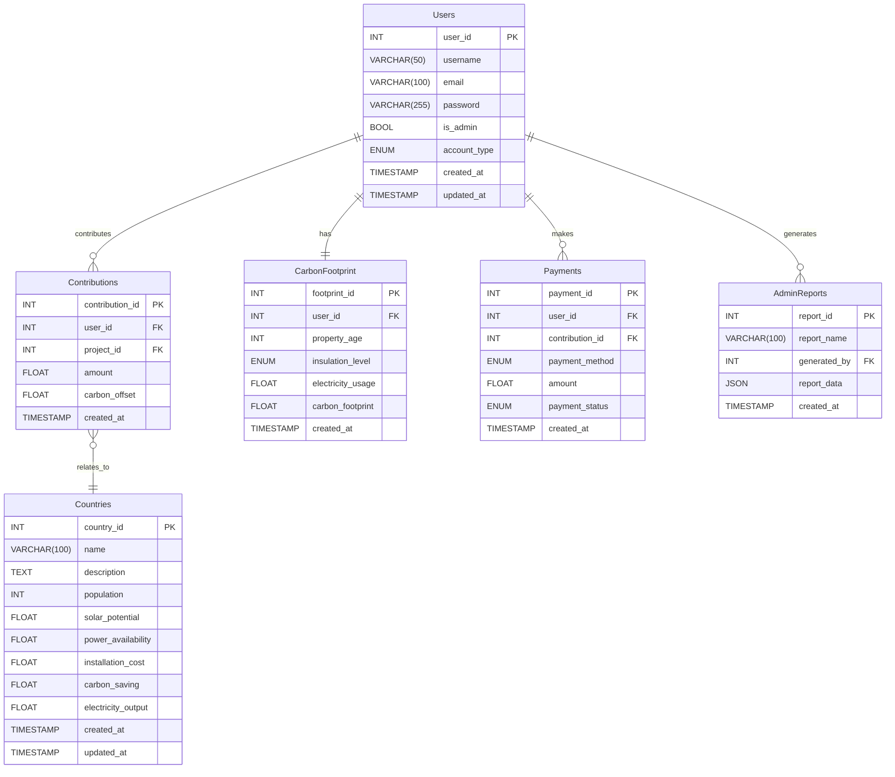

# Database Design Documentation

## Overview

#### Entity Description

- **Users**: Basic information and account management for household users.
- **Countries**: Fundable countries and their solar energy-related information.
- **Contributions**: Funding records of household users.
- **CarbonFootprint**: Carbon footprint data of household users.
- **Payments**: Payment records of household users.
- **AdminReports**: Statistical and reporting information for administrators.

#### Entity-Relationship Diagram

#### Relationships

- Users -> Contributions: One-to-Many (A user can make multiple contributions)
- Countries -> Contributions: One-to-Many (A country can receive multiple contributions)
- Users -> CarbonFootprint: One-to-One (Each user has one carbon footprint record)
- Users -> Payments: One-to-Many (A user can have multiple payment records)
- Users -> AdminReports: One-to-Many (An admin can generate multiple reports)

#### Attribute Description

##### Users

- **user_id**: Unique identifier for the householder.
- **username**: Username of the householder.
- **email**: Email address of the householder.
- **password**: Encrypted password of the householder.
- **is_admin**: Flag for admin account.
- **account_type**: Type of user account (e.g., householder or admin or others...).
- **created_at**: Timestamp of when the account was created.
- **updated_at**: Timestamp of the last account update.

##### Contributions

- **contribution_id**: Unique identifier for the contribution record.
- **householder_id**: Identifier of the householder making the contribution.
- **country_id**: Identifier of the country receiving the contribution.
- **amount**: Amount contributed by the householder (in USD).
- **carbon_offset**: Amount of carbon offset achieved by the contribution (in tons).
- **created_at**: Timestamp of when the contribution was made.

##### CarbonFootprint

- **footprint_id**: Unique identifier for the carbon footprint record.
- **householder_id**: Identifier of the householder associated with the record.
- **property_age**: Age of the property where the householder resides.
- **insulation_level**: Insulation level of the property (e.g., low, medium, high).
- **electricity_usage**: Annual electricity usage of the property (e.g., in kWh).
- **carbon_footprint**: Total carbon footprint of the householder (e.g., in tons/year).
- **created_at**: Timestamp of when the carbon footprint record was created.

##### Payments

- **payment_id**: Unique identifier for the payment record.
- **householder_id**: Identifier of the householder making the payment.
- **contribution_id**: Identifier of the associated contribution.
- **payment_method**: Payment method used (e.g., PayPal or Stripe).
- **amount**: Payment amount (in USD).
- **payment_status**: Status of the payment (e.g., pending, completed, or failed).
- **created_at**: Timestamp of when the payment was made.

##### AdminReports

- **report_id**: Unique identifier for the admin report.
- **report_name**: Name of the report.
- **generated_by**: Identifier of the admin who generated the report.
- **report_data**: Details of the report content (stored in JSON format).
- **created_at**: Timestamp of when the report was generated.

##### Countries

- **country_id**: Unique identifier for the country.
- **name**: Name of the country.
- **description**: Description of the country, such as solar potential or relevant information.
- **population**: Population of the country.
- **solar_potential**: Solar energy potential in the country (e.g., in GW).
- **grid_availability**: Availability of electricity grid (in percentage).
- **installation_cost**: Cost of installing solar panels in the country (in USD).
- **carbon_saving**: Estimated carbon savings from solar installations (in tons/year).
- **electricity_output**: Electricity output from solar installations (in MW).
- **created_at**: Timestamp of when the country data was added.
- **updated_at**: Timestamp of the last update to the country data.

## Update History

#### 2025-03-11
- Changed "householder" to "user" for better clarity
- Renamed "account_status" attribute to "account_type"
- Added "is_admin" flag for quick admin checks
- User types are now identified by "account_type" (householder/admin)
